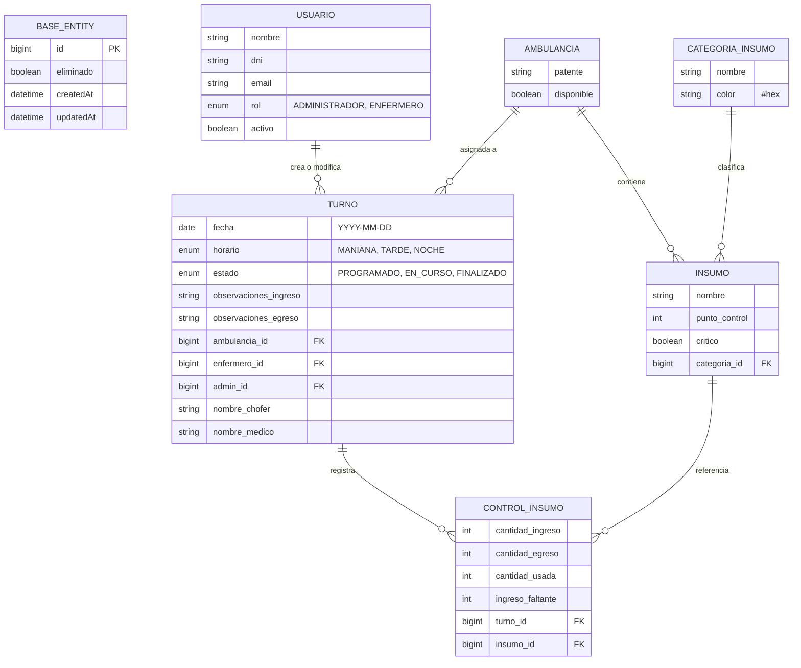

# Sistema de Gestión y Trazabilidad de Emergencias 107
### Trabajo Integrador Final (TFI) - UTN

## Integrantes

- Andres Bonelli
- Hugo Catalan
- Matias Carro

### Trabajo Integrador Final (TFI) - UTN

        Sistema web de gestión de guardias, control de stock de ambulancias, trazabilidad e inconsistencias entre turnos y cálculo de insumos críticos (oxígeno para traslados).

### Introducción

El presente **Trabajo Práctico Integrador** propone el desarrollo de una aplicación web destinada a mejorar la gestión y trazabilidad de los turnos de trabajo, las ambulancias y los controles de insumos utilizados por el servicio de emergencias 107. La propuesta surge a partir del análisis de un proceso que actualmente se realiza principalmente mediante registros manuales en planillas de papel. En estos registros se deja constancia de información relacionada con la ambulancia, el personal que participa de la guardia, el estado general de la unidad y la disponibilidad de los distintos insumos y equipamientos necesarios para prestar el servicio.
El objetivo del proyecto no es simplemente reemplazar la planilla de papel por una versión digital, sino aprovechar las posibilidades que brinda una aplicación informática para mejorar la trazabilidad de la información, facilitar el control entre turnos, detectar diferencias, conservar un historial y generar información útil para la gestión administrativa.
La propuesta se desarrollará teniendo en cuenta los conceptos trabajados en la materia relacionados con calidad de software, diseño, mantenibilidad, principios SOLID, Clean Code, testing, refactoring y reducción de deuda técnica

### Stack Tecnologico

**Se utilizará el siguiente Stack:**

- **Frontend**
  - React
  - Vite.
  - Typescript 
  - Con consideración de utilizar Tailwind

- **Backend**
  - Java 
  - Spring Boot 

- **Base de datos**
  - Base relacional SQL (MySQL)

---

## 📄 Documentación y Presentación
* 📘 [Documento de Introducción (PDF)](Introduccion.pdf)
* 📊 [Presentación de la Propuesta (PDF)](Propuesta.pdf)

---

# Documentacion Tecnica – Segunda Entrega  
## Sistema de Gestión y Trazabilidad 107

---

# Descripción General del Proyecto

El sistema gestiona la trazabilidad operativa de las ambulancias del servicio 107.  
Digitaliza el proceso de control de stock, turnos de guardia, ingreso/egreso de móviles y detección de inconsistencias entre turnos.

El dominio está centrado en:

- **Ambulancia**
- **Turno de Guardia**
- **Control de Ingreso**
- **Control de Egreso**
- **Insumos**
- **Detalle de Stock**
- **Tickets de Inconsistencia**
- **Usuarios (Admin / Enfermero)**

El objetivo es reemplazar las planillas físicas, mejorando y garantizando:

- Trazabilidad   
- Auditoría entre ingreso y egreso  
- Detección de inconsistencias  
- Registro de faltantes  
- Gestión de alertas e inconsistencias  

---

# Diseño de Base de Datos (Relacional – SQL)

## Entidades del Sistema

---

## 🟦 AMBULANCIA
| Campo | Tipo | Descripción |
|-------|------|-------------|
| id | bigint | Identificador |
| nroMovil | string | Número interno |
| patente | string | Patente |
| codigoQR | string | Identificador QR |
| estado | enum | Estado operativo |
| presionOxigenoPsi | int | Presión del tubo |
| kilometrajeActual | double | Kilometraje |

---

## 🟦 USUARIO
| Campo | Tipo | Descripción |
|-------|------|-------------|
| id | bigint | Identificador |
| nombre | string | Nombre |
| dni | string | Documento |
| email | string | Correo |
| rol | enum | ADMINISTRADOR / ENFERMERO |
| activo | boolean | Estado |

---

## 🟦 INSUMO
| Campo | Tipo | Descripción |
|-------|------|-------------|
| id | bigint | Identificador |
| nombre | string | Nombre del insumo |
| categoria | string | Categoría textual (NO FK) |
| puntoDeControl | int | Cantidad esperada |
| esCritico | boolean | Indica si es crítico |

---

## 🟦 TURNO_GUARDIA
| Campo | Tipo | Descripción |
|-------|------|-------------|
| id | bigint | Identificador |
| fecha | date | Fecha del turno |
| horaInicio | string | Hora inicio |
| horaFin | string | Hora fin |
| estado | enum | PROGRAMADO / EN_CURSO / FINALIZADO |
| admin_id | FK | Usuario Admin creador |
| ambulancia_id | FK | Ambulancia asignada |
| personalAsignado | N–N | Usuarios asignados |

---

## 🟦 CONTROL_INGRESO
| Campo | Tipo | Descripción |
|-------|------|-------------|
| id | bigint | Identificador |
| fechaHora | datetime | Fecha/hora del control |
| hayFaltantes | boolean | Si faltan insumos |
| aptoParaSalir | boolean | Si la ambulancia puede salir |
| observacionProblema | string | Observaciones |
| turno_guardia_id | FK | Turno asociado |
| enfermero_id | FK | Enfermero responsable |

---

## 🟦 DETALLE_STOCK_INGRESO
| Campo | Tipo | Descripción |
|-------|------|-------------|
| id | bigint | Identificador del insumo |
| control_ingreso_id | FK | ControlIngreso |
| insumo_id | FK | Insumo recibido |
| cantidadRecibida | int | Cantidad recibida |

---

## 🟦 CONTROL_EGRESO
| Campo | Tipo | Descripción |
|-------|------|-------------|
| id | bigint | Identificador |
| fechaHora | datetime | Fecha/hora del egreso |
| turno_guardia_id | FK | Turno asociado |
| enfermero_id | FK | Enfermero responsable |

---

## 🟦 DETALLE_STOCK_EGRESO
| Campo | Tipo | Descripción |
|-------|------|-------------|
| id | bigint | Identificador |
| control_egreso_id | FK | ControlEgreso |
| insumo_id | FK | Insumo |
| cantidadDejada | int | Cantidad entregada |

---

## 🟦 INCONSISTENCIA_TICKET
| Campo | Tipo | Descripción |
|-------|------|-------------|
| id | bigint | Identificador |
| fechaHoraDeteccion | datetime | Momento de detección |
| cantidadDejadaAnterior | int | Stock final del turno anterior |
| cantidadRecibidaActual | int | Stock inicial del turno actual |
| diferencia | int | Diferencia detectada |
| estado | enum | PENDIENTE / EN_REVISION / RESUELTO |
| observacionesAdmin | string | Observaciones |
| control_ingreso_id | FK | ControlIngreso |
| control_egreso_anterior_id | FK | ControlEgreso |
| insumo_id | FK | Insumo |
| admin_asignado_id | FK | Usuario |

---

# Relaciones del Modelo

- Ambulancia 1–N TurnoGuardia  
- Usuario 1–N TurnoGuardia (admin)  
- Usuario N–N TurnoGuardia (personal asignado)  
- TurnoGuardia 1–1 ControlIngreso  
- TurnoGuardia 1–1 ControlEgreso  
- ControlIngreso 1–N DetalleStockIngreso  
- ControlEgreso 1–N DetalleStockEgreso  
- Insumo 1–N DetalleStockIngreso  
- Insumo 1–N DetalleStockEgreso  
- InconsistenciaTicket N–1 ControlIngreso  
- InconsistenciaTicket N–1 ControlEgreso  
- InconsistenciaTicket N–1 Insumo  
- InconsistenciaTicket N–1 Usuario (admin asignado)

---

# Diagrama ER (Mermaid)

# Reglas de Negocio (RN)
**RN-01 — Turno exclusivo por ambulancia**
Una ambulancia no puede estar en dos turnos simultáneamente.

**RN-02 — Personal asignado**
Un turno puede tener múltiples usuarios asignados (ManyToMany).

**RN-03 — Faltantes**
Si un insumo está por debajo del punto de control se marca como faltante.

**RN-04 — Aptitud del móvil**
Si hay faltantes críticos el movil no esta apto para salir.

**RN-05 — Trazabilidad entre turnos**
Se compara:  
- cantidadDejadaAnterior (egreso anterior)  
- cantidadRecibidaActual (ingreso actual)

**RN-06 — Tickets de inconsistencia**
Toda diferencia genera un ticket.

**RN-07 — Roles**
Solo *ADMIN* crea turnos.  
Solo *ENFERMERO* realiza controles.

--- 

# Módulos del Backend y Responsabilidades

A continuación se detallan los módulos funcionales del backend, junto con sus responsabilidades y las entidades que intervienen en cada uno.

---

## 1. Módulo de Usuarios
### Responsabilidades
- Gestión de usuarios del sistema  
- Administración de roles (ADMINISTRADOR / ENFERMERO)  
- Control de estado del usuario (activo/inactivo)

---

## 2. Módulo de Ambulancias
### Responsabilidades
- Gestión de ambulancias  
- Estado operativo del móvil  
- Datos técnicos (patente, presión de oxígeno, kilometraje)

---

## 3. Módulo de Insumos
### Responsabilidades
- Catálogo de insumos  
- Punto de control por insumo  
- Identificación de insumos críticos  
- 
---

## 4. Módulo de Turnos de Guardia
### Responsabilidades
- Crear turnos de guardia  
- Asignar ambulancia  
- Asignar personal  
- Registrar estado del turno (PROGRAMADO, EN_CURSO, FINALIZADO)

---

## 5. Módulo de Control de Ingreso
### Responsabilidades
- Validar faltantes  
- Aptitud para salir  
- Registrar observaciones del ingreso  
- Registrar stock recibido por insumo

---

## 6. Módulo de Control de Egreso
### Responsabilidades
- Registrar egreso del móvil  
- Registrar stock dejado por insumo  
- Registrar observaciones finales del turno

---

## 7. Módulo de Estadísticas / Dashboard
### Responsabilidades
- Generar resumen operativo  
- Mostrar alertas   
- Listar ambulancias disponibles  
- Mostrar turnos activos  
- Mostrar controles

---

# Módulos del Frontend y Responsabilidades 

A continuación se detallan los módulos funcionales del frontend, junto con sus responsabilidades y las entidades que intervienen en cada uno.

## 1. Login
- Autenticación de usuario
- Redirección según rol (ADMIN / ENFERMERO)

---

## 2. Módulo Operativo del Enfermero 
- Selección de turno activo
- Control de Ingreso:
  - Cantidades recibidas
  - Faltantes
  - Observaciones
- Control de Egreso:
  - Cantidades dejadas
  - Observaciones
- Alertas del turno
- Finalización del turno

---

## 3. Panel de Administración 

### Módulo de Usuarios
- Crear, editar, activar/desactivar usuarios
- Gestión de roles

### Módulo de Ambulancias
- Crear/editar ambulancias
- Estado operativo
- Datos técnicos

### Módulo de Insumos
- Crear/editar insumos
- Punto de control
- Críticos

### Módulo de Turnos
- Crear turnos
- Asignar ambulancia
- Asignar personal
- Cambiar estado

## 4. Dashboard
- Turnos activos
- Ambulancias disponibles
- Alertas 
- Controles incompletos

