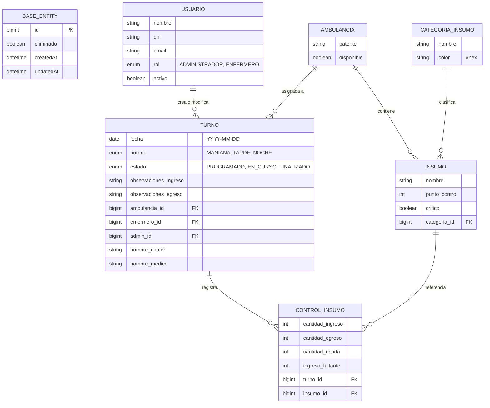

# Sistema de Gestión y Trazabilidad de Emergencias 107
### Trabajo Integrador Final (TFI) - UTN

## Integrantes

- Andres Bonelli
- Hugo Catalan
- Matias Carro

### Trabajo Integrador Final (TFI) - UTN

        Sistema web de gestión de guardias, control de stock de ambulancias, trazabilidad e inconsistencias entre turnos y cálculo de insumos críticos (oxígeno para traslados).

### Introducción

El presente **Trabajo Práctico Integrador** propone el desarrollo de una aplicación web destinada a mejorar la gestión y trazabilidad de los turnos de trabajo, las ambulancias y los controles de insumos utilizados por el servicio de emergencias 107. La propuesta surge a partir del análisis de un proceso que actualmente se realiza principalmente mediante registros manuales en planillas de papel. En estos registros se deja constancia de información relacionada con la ambulancia, el personal que participa de la guardia, el estado general de la unidad y la disponibilidad de los distintos insumos y equipamientos necesarios para prestar el servicio.
El objetivo del proyecto no es simplemente reemplazar la planilla de papel por una versión digital, sino aprovechar las posibilidades que brinda una aplicación informática para mejorar la trazabilidad de la información, facilitar el control entre turnos, detectar diferencias, conservar un historial y generar información útil para la gestión administrativa.
La propuesta se desarrollará teniendo en cuenta los conceptos trabajados en la materia relacionados con calidad de software, diseño, mantenibilidad, principios SOLID, Clean Code, testing, refactoring y reducción de deuda técnica

### Stack Tecnologico

**Se utilizará el siguiente Stack:**

- **Frontend**
  - React
  - Vite.
  - Typescript 
  - Con consideración de utilizar Tailwind

- **Backend**
  - Java 
  - Spring Boot 

- **Base de datos**
  - Base relacional SQL (MySQL)

---

## 📄 Documentación y Presentación
* 📘 [Documento de Introducción (PDF)](Introduccion.pdf)
* 📊 [Presentación de la Propuesta (PDF)](Propuesta.pdf)

---

# Documentacion Tecnica – Segunda Entrega  
## Sistema de Gestión y Trazabilidad 107 – Backend (Java + Spring Boot)

---

# Descripción General del Proyecto

El sistema gestiona la trazabilidad operativa de las ambulancias del servicio 107.
Digitaliza el proceso de control de stock, turnos de guardia, ingreso/egreso de móviles y detección de inconsistencias entre turnos.

El modelo está **centrado en el Turno**, que representa la unidad operativa principal:

- **Ambulancia asignada**
- **Equipo de trabajo** (admin, enfermero, chofer, médico)
- **Control de insumos** al ingreso y egreso
- **Observaciones del turno**
- **Detección de inconsistencias entre turnos consecutivos**

El objetivo es reemplazar las planillas físicas, garantizando:

- Trazabilidad completa  
- Auditoría entre ingreso y egreso  
- Detección automática de inconsistencias  
- Registro de faltantes  
- Gestión de alertas  
- Historial operativo por ambulancia y usuario  

---

# Diseño de Base de Datos (Relacional – SQL)

## Entidades del Sistema

---
##  BaseEntity – Clase Base del Modelo  
La clase **BaseEntity** define los campos comunes para todas las entidades del sistema.  
Incluye auditoría automática, borrado lógico y configuración estándar de JPA.

| Campo | Tipo | Descripción |
|-------|------|-------------|
| **id** | Long | Identificador único autogenerado |
| **createdAt** | LocalDateTime | Fecha/hora de creación del registro |
| **updatedAt** | LocalDateTime | Fecha/hora de última actualización |
| **eliminado** | boolean | Marca de borrado lógico |
| **borradoLogico()** | método | Cambia `eliminado` a `true` |

--- 

## AMBULANCIA
Representa un móvil del servicio 107.

| Campo | Tipo | Descripción |
|-------|------|-------------|
| id | bigint | Identificador |
| patente | string | Patente única |
| disponible | boolean | Estado operativo |
| insumos | N–N Insumo | Insumos base que debe tener |

---

## USUARIO
| Campo | Tipo | Descripción |
|-------|------|-------------|
| id | bigint | Identificador |
| nombre | string | Nombre |
| dni | string | Documento |
| email | string | Correo |
| rol | enum RolUsuario | ADMINISTRADOR / ENFERMERO |
| activo | boolean | Estado |
| clave.hash | string | Hash de contraseña |
| clave.salt | string | Salt |

---

## CATEGORIA_INSUMO
| Campo | Tipo | Descripción |
|-------|------|-------------|
| id | bigint | Identificador |
| nombre | string | Nombre |
| color | string | Color visual |

---

## INSUMO
| Campo | Tipo | Descripción |
|-------|------|-------------|
| id | bigint | Identificador |
| nombre | string | Nombre del insumo |
| categoria_id | FK | Categoría |
| puntoControl | int | Cantidad esperada |
| critico | boolean | Indica si es crítico |

---

## TURNO (Entidad central del dominio)
El turno contiene **todo**: ambulancia, usuarios, insumos, observaciones y estado.

| Campo | Tipo | Descripción |
|-------|------|-------------|
| id | bigint | Identificador |
| fecha | date | Fecha del turno |
| horario | enum HorarioTurno | MAÑANA / TARDE / NOCHE |
| estado | enum EstadoTurno | PROGRAMADO / EN_CURSO / FINALIZADO |
| ambulancia_id | FK | Ambulancia asignada |
| enfermero_id | FK | Enfermero responsable |
| admin_id | FK | Administrador |
| nombreChofer | string | Chofer |
| nombreMedico | string | Médico |
| observacionesIngreso | text | Observaciones del ingreso |
| observacionesEgreso | text | Observaciones del egreso |
| controlInsumos | 1–N ControlInsumo | Detalle de stock |

---

## CONTROL_INSUMO
Detalle de stock del turno.

| Campo | Tipo | Descripción |
|-------|------|-------------|
| id | bigint | Identificador |
| turno_id | FK | Turno |
| insumo_id | FK | Insumo |
| cantidadIngreso | int | Cantidad al ingreso |
| cantidadEgreso | int | Cantidad al egreso |
| ingresoFaltante | int | Faltantes detectados |
| cantidadUsada | int | Cantidad utilizada |

---

# Relaciones del Modelo

- Ambulancia 1–N Turno  
- Usuario 1–N Turno (admin y enfermero)  
- Turno 1–N ControlInsumo  
- Insumo 1–N ControlInsumo  
- Ambulancia N–N Insumo (stock base)  

---

# Diagrama ER (Mermaid)

# Reglas de Negocio (RN)
**RN-01 — Turno exclusivo por ambulancia**
Una ambulancia no puede estar en dos turnos simultáneamente.

**RN-02 — Personal asignado**
Un turno puede tener múltiples usuarios asignados (ManyToMany).

**RN-03 — Faltantes**
Si un insumo está por debajo del punto de control se marca como faltante.

**RN-04 — Trazabilidad de insumo**
Se compara la cantidad de insumos recibidos y los dejados al final del turno

**RN-05 — Roles**
Solo *ADMIN* crea turnos.  
Solo *ENFERMERO* realiza controles.

--- 
# Módulos del Backend y Responsabilidades  

A continuación se detallan los módulos funcionales del backend según el código provisto.  
Cada módulo lista únicamente las responsabilidades y entidades que aparecen en el código.

## 1. Módulo de Usuarios
### Responsabilidades
- Representar usuarios del sistema (ADMINISTRADOR / ENFERMERO).  
- Gestionar datos básicos del usuario: nombre, DNI, email, rol, estado.  
- Manejar credenciales 

---

## 2. Módulo de Ambulancias
### Responsabilidades
- Representar ambulancias del sistema.  
- Gestionar disponibilidad del móvil.  
- Asociar insumos base mediante relación ManyToMany.  
- Exponer datos mediante DTO.

---

## 3. Módulo de Insumos
### Responsabilidades
- Representar insumos utilizados por ambulancias.  
- Asociar cada insumo a una categoría 
- Definir punto de control esperado.  
- Indicar si el insumo es crítico.

---

## 4. Módulo de Turnos
### Responsabilidades
- Representar el turno operativo (entidad central del dominio).  
- Asociar ambulancia, enfermero y administrador.  
- Registrar horario y estado del turno.  
- Registrar chofer y médico.  
- Registrar observaciones de ingreso y egreso.  
- Gestionar el detalle de insumos del turno 

---

## 5. Módulo de Control de Insumos del Turno
### Responsabilidades
- Registrar cantidades de insumos al ingreso.  
- Registrar cantidades de insumos al egreso.  
- Registrar faltantes.  
- Registrar cantidad usada.  
- Asociar cada registro al turno correspondiente.

---

## 6. Módulo de Estadísticas / Dashboard
### Responsabilidades
- Generar resumen operativo del sistema.  
- Mostrar cantidad de turnos activos.  
- Mostrar ambulancias disponibles y totales.  
- Mostrar alertas e inconsistencias.  
- Listar ambulancias.

---

# Módulos del Frontend y Responsabilidades 

A continuación se detallan los módulos funcionales del frontend, junto con sus responsabilidades y las entidades que intervienen en cada uno.

## 1. Login
- Autenticación de usuario
- Redirección según rol (ADMIN / ENFERMERO)

---

## 2. Módulo Operativo del Enfermero 
- Selección de turno activo
- Control de Ingreso:
  - Cantidades recibidas
  - Faltantes
  - Observaciones
- Control de Egreso:
  - Cantidades dejadas
  - Observaciones
- Alertas del turno
- Finalización del turno

---

## 3. Panel de Administración 

### Módulo de Usuarios
- Crear, editar, activar/desactivar usuarios
- Gestión de roles

### Módulo de Ambulancias
- Crear/editar ambulancias
- Estado operativo
- Datos técnicos

### Módulo de Insumos
- Crear/editar insumos
- Punto de control
- Críticos

### Módulo de Turnos
- Crear turnos
- Asignar ambulancia
- Asignar personal
- Cambiar estado

## 4. Dashboard
- Turnos activos
- Ambulancias disponibles
- Alertas 
- Controles incompletos

