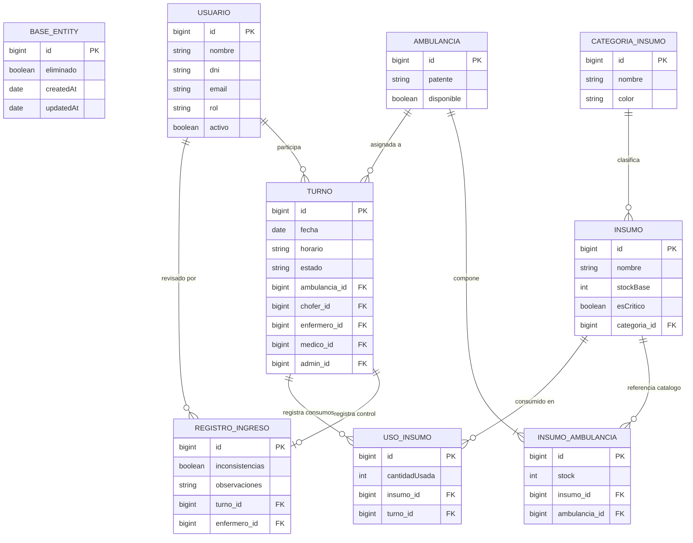

## Diagrama Entidad Relación (DER)

```mermaid
erDiagram

    BASE_ENTITY {
        bigint id PK
        boolean eliminado
        date createdAt
        date updatedAt
    }
    
    USUARIO {
        bigint id PK
        string nombre
        string dni
        string email
        string rol
        boolean activo
    }

    AMBULANCIA {
        bigint id PK
        string patente
        boolean disponible
    }

    CATEGORIA_INSUMO {
        bigint id PK
        string nombre
        string color
    }

    INSUMO {
        bigint id PK
        string nombre
        int stockBase
        boolean esCritico
        bigint categoria_id FK
    }

    INSUMO_AMBULANCIA {
        bigint id PK
        int stock
        bigint insumo_id FK
        bigint ambulancia_id FK
    }

    TURNO {
        bigint id PK
        date fecha
        string horario
        string estado
        bigint ambulancia_id FK
        bigint chofer_id FK
        bigint enfermero_id FK
        bigint medico_id FK
        bigint admin_id FK
    }

    REGISTRO_INGRESO {
        bigint id PK
        boolean inconsistencias
        string observaciones
        bigint turno_id FK
        bigint enfermero_id FK
    }

    USO_INSUMO {
        bigint id PK
        int cantidadUsada
        bigint insumo_id FK
        bigint turno_id FK
    }


    CATEGORIA_INSUMO ||--o{ INSUMO : "clasifica"
    INSUMO ||--o{ INSUMO_AMBULANCIA : "referencia catalogo"
    AMBULANCIA ||--|{ INSUMO_AMBULANCIA : "compone"
    AMBULANCIA ||--o{ TURNO : "asignada a"
    USUARIO ||--o{ TURNO : "participa"
    TURNO ||--o| REGISTRO_INGRESO : "registra control"
    USUARIO ||--o{ REGISTRO_INGRESO : "revisado por"
    TURNO ||--o{ USO_INSUMO : "registra consumos"
    INSUMO ||--o{ USO_INSUMO : "consumido en"
```
