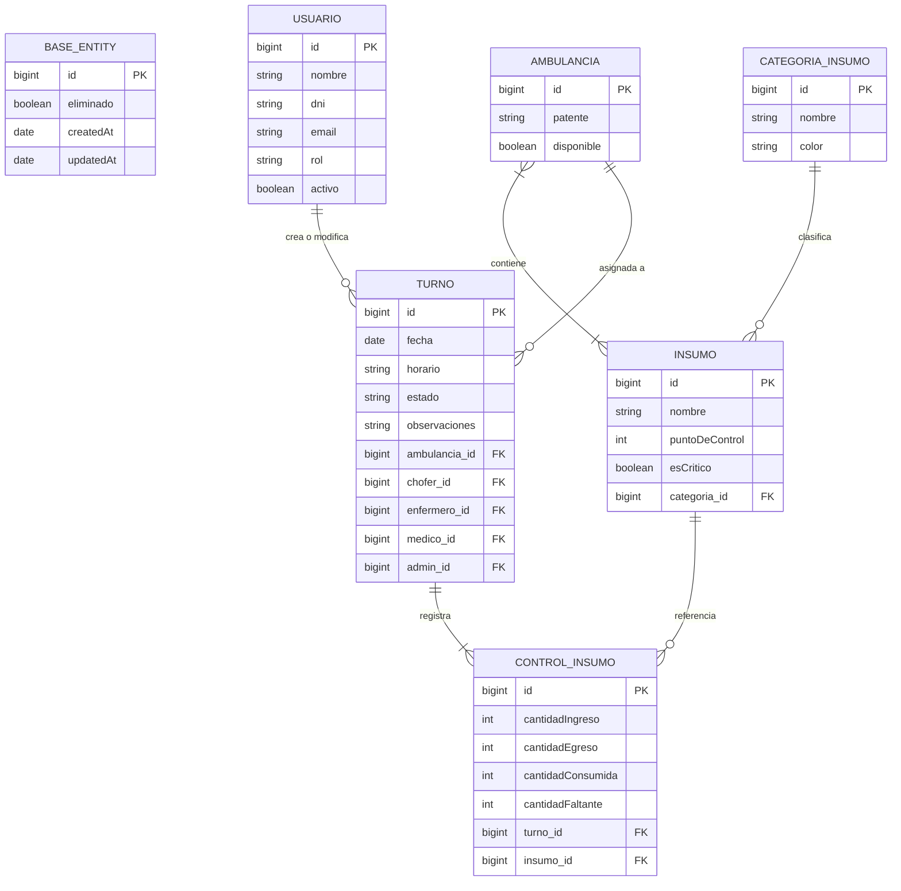

## Diagrama Entidad Relación (DER)

```mermaid
erDiagram

    BASE_ENTITY {
        bigint id PK
        boolean eliminado
        date createdAt
        date updatedAt
    }
    
    USUARIO {
        bigint id PK
        string nombre
        string dni
        string email
        string rol
        boolean activo
    }

    AMBULANCIA {
        bigint id PK
        string patente
        boolean disponible
    }

    CATEGORIA_INSUMO {
        bigint id PK
        string nombre
        string color
    }

    INSUMO {
        bigint id PK
        string nombre
        int puntoDeControl
        boolean esCritico
        bigint categoria_id FK
    }

    TURNO {
        bigint id PK
        date fecha
        string horario
        string estado
        string observaciones
        bigint ambulancia_id FK
        bigint chofer_id FK
        bigint enfermero_id FK
        bigint medico_id FK
        bigint admin_id FK
    }

    CONTROL_INSUMO {
        bigint id PK
        int cantidadIngreso
        int cantidadEgreso
        int cantidadConsumida
        int cantidadFaltante
        bigint turno_id FK
        bigint insumo_id FK
    }

    CATEGORIA_INSUMO ||--o{ INSUMO : "clasifica"
    AMBULANCIA }|--|{ INSUMO : "contiene"
    AMBULANCIA ||--o{ TURNO : "asignada a"
    USUARIO ||--o{ TURNO : "crea o modifica"
    TURNO ||--|{ CONTROL_INSUMO : "registra"
    INSUMO ||--o{ CONTROL_INSUMO : "referencia"
```
