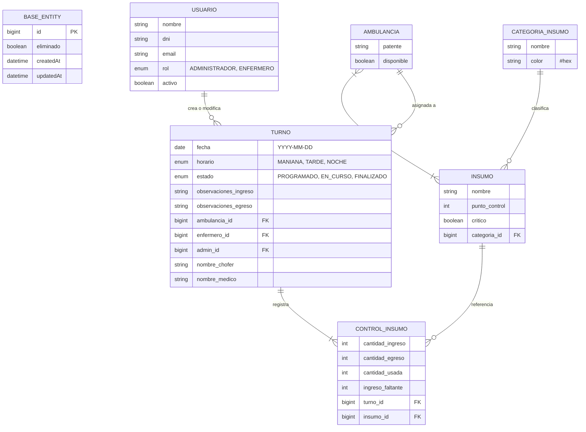

## Diagrama Entidad Relación (DER)

```mermaid
erDiagram

    BASE_ENTITY {
        bigint id PK
        boolean eliminado
        datetime createdAt
        datetime updatedAt
    }
    
    USUARIO {
        string nombre
        string dni
        string email
        enum rol "ADMINISTRADOR, ENFERMERO"
        boolean activo
    }

    AMBULANCIA {
        string patente
        boolean disponible
    }

    CATEGORIA_INSUMO {
        string nombre
        string color "#hex"
    }

    INSUMO {
        string nombre
        int punto_control
        boolean critico
        bigint categoria_id FK
    }

    TURNO {
        date fecha "YYYY-MM-DD"
        enum horario "MANIANA, TARDE, NOCHE"
        enum estado "PROGRAMADO, EN_CURSO, FINALIZADO"
        string observaciones_ingreso
        string observaciones_egreso
        bigint ambulancia_id FK
        bigint enfermero_id FK
        bigint admin_id FK
        string nombre_chofer
        string nombre_medico
    }

    CONTROL_INSUMO {
        int cantidad_ingreso
        int cantidad_egreso
        int cantidad_usada
        int ingreso_faltante
        bigint turno_id FK
        bigint insumo_id FK
    }

    CATEGORIA_INSUMO ||--o{ INSUMO : "clasifica"
    AMBULANCIA }|--|{ INSUMO : "contiene"
    AMBULANCIA ||--o{ TURNO : "asignada a"
    USUARIO ||--o{ TURNO : "crea o modifica"
    TURNO ||--|{ CONTROL_INSUMO : "registra"
    INSUMO ||--o{ CONTROL_INSUMO : "referencia"
```
