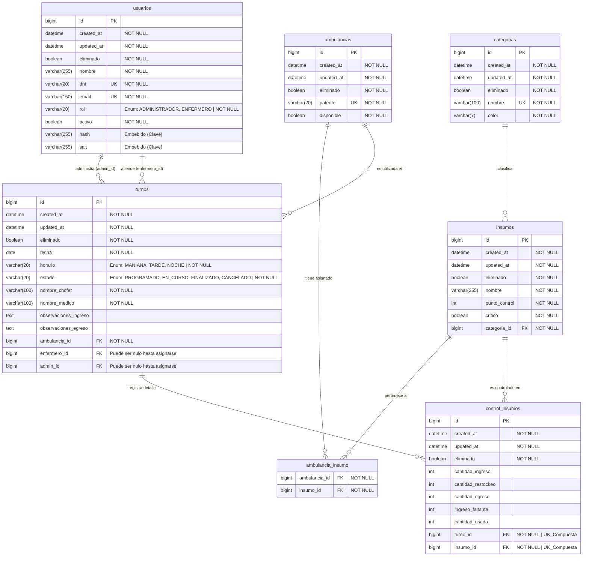

## Diagrama Entidad Relación (DER)

```mermaid
erDiagram
    usuarios {
        bigint id PK
        datetime created_at "NOT NULL"
        datetime updated_at "NOT NULL"
        boolean eliminado "NOT NULL"
        varchar(255) nombre "NOT NULL"
        varchar(20) dni UK "NOT NULL"
        varchar(150) email UK "NOT NULL"
        varchar(20) rol "Enum: ADMINISTRADOR, ENFERMERO | NOT NULL"
        boolean activo "NOT NULL"
        varchar(255) hash "Embebido (Clave)"
        varchar(255) salt "Embebido (Clave)"
    }

    ambulancias {
        bigint id PK
        datetime created_at "NOT NULL"
        datetime updated_at "NOT NULL"
        boolean eliminado "NOT NULL"
        varchar(20) patente UK "NOT NULL"
        boolean disponible "NOT NULL"
    }

    categorias {
        bigint id PK
        datetime created_at "NOT NULL"
        datetime updated_at "NOT NULL"
        boolean eliminado "NOT NULL"
        varchar(100) nombre UK "NOT NULL"
        varchar(7) color "NOT NULL"
    }

    insumos {
        bigint id PK
        datetime created_at "NOT NULL"
        datetime updated_at "NOT NULL"
        boolean eliminado "NOT NULL"
        varchar(255) nombre "NOT NULL"
        int punto_control "NOT NULL"
        boolean critico "NOT NULL"
        bigint categoria_id FK "NOT NULL"
    }

    ambulancia_insumo {
        bigint ambulancia_id FK "NOT NULL"
        bigint insumo_id FK "NOT NULL"
    }

    turnos {
        bigint id PK
        datetime created_at "NOT NULL"
        datetime updated_at "NOT NULL"
        boolean eliminado "NOT NULL"
        date fecha "NOT NULL"
        varchar(20) horario "Enum: MANIANA, TARDE, NOCHE | NOT NULL"
        varchar(20) estado "Enum: PROGRAMADO, EN_CURSO, FINALIZADO, CANCELADO | NOT NULL"
        varchar(100) nombre_chofer "NOT NULL"
        varchar(100) nombre_medico "NOT NULL"
        text observaciones_ingreso
        text observaciones_egreso
        bigint ambulancia_id FK "NOT NULL"
        bigint enfermero_id FK "Puede ser nulo hasta asignarse"
        bigint admin_id FK "Puede ser nulo hasta asignarse"
    }

    control_insumos {
        bigint id PK
        datetime created_at "NOT NULL"
        datetime updated_at "NOT NULL"
        boolean eliminado "NOT NULL"
        int cantidad_ingreso
        int cantidad_restockeo
        int cantidad_egreso
        int ingreso_faltante
        int cantidad_usada
        bigint turno_id FK "NOT NULL | UK_Compuesta"
        bigint insumo_id FK "NOT NULL | UK_Compuesta"
    }

    %% ========================================================================
    %% RELACIONES
    %% ========================================================================

    categorias ||--o{ insumos : "clasifica"
    ambulancias ||--o{ ambulancia_insumo : "tiene asignado"
    insumos ||--o{ ambulancia_insumo : "pertenece a"
    ambulancias ||--o{ turnos : "es utilizada en"
    usuarios ||--o{ turnos : "administra (admin_id)"
    usuarios ||--o{ turnos : "atiende (enfermero_id)"
    turnos ||--o{ control_insumos : "registra detalle"
    insumos ||--o{ control_insumos : "es controlado en"
```
